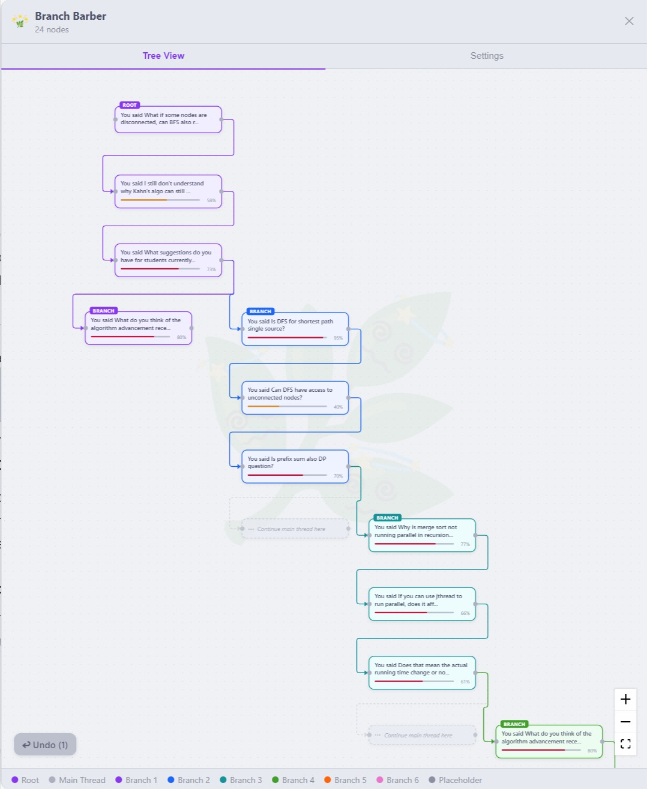

# Branch Barber

<p align="center">
  
</p>

> **Stop shaving the yak. Start climbing the tree.**

**Branch Barber** is a Chrome Extension that transforms linear AI chat logs into a live, interactive **Conversation Tree**. It automatically detects when your conversation drifts to a new topic, visualizes that drift as a branch in a node graph, and gives you precise tools to navigate, reorganize, and annotate your thinking in real time.

Supported platforms: **ChatGPT** (chatgpt.com, chat.openai.com) and **Google Gemini** (gemini.google.com).

<p align="center">
  
</p>

---

## The Problem: Context Drift in AI Conversations

AI chat interfaces are linear. Real thinking is not. A session that starts with "Build a machine learning model" quickly spirals:

```
Root:         Build an ML model
  └─ Branch:  Fix Python environment path
       └─ Branch:  Debug shell permissions
            └─ Now: Researching Linux kernel flags
```

By the time you answer the tenth side question, you've forgotten why you opened the chat. Branch Barber maps exactly this kind of drift, labels each diversion, and lets you jump back to any point in the tree without losing work.

---

## Getting Started

### Build

```bash
npm install
npm run build      # output → dist/
```

For development with live reload:

```bash
npm run dev        # Webpack in watch mode
```

### Load in Chrome

1. Open `chrome://extensions/`
2. Enable **Developer mode** (toggle in the top-right corner)
3. Click **Load unpacked** and select the `dist/` folder
4. Navigate to `chatgpt.com` or `gemini.google.com`
5. Branch Barber automatically activates — the sidebar appears on the right side of the page

### Reload After Changes

After rebuilding, go to `chrome://extensions/` and click the ↺ refresh icon on the Branch Barber card. Then hard-reload the AI chat tab (`Ctrl+Shift+R`).

---

## Architecture

```
src/
├── background/
│   └── index.ts             # MV3 service worker — routes EMBED messages to offscreen doc,
│                            # manages keepalive alarm, ensures offscreen document stays alive
├── offscreen/
│   └── index.ts             # Offscreen document — loads Transformers.js WASM pipeline,
│                            # pre-warms all-MiniLM-L6-v2 on startup, handles EMBED requests
├── content/
│   ├── index.ts             # Entry point — mounts sidebar, wires bb-reset / bb-rescale listeners
│   ├── observer.ts          # Core pipeline: MutationObserver → drift detection →
│   │                        # node creation → DB write → store update → button injection
│   ├── selectors.ts         # Platform-specific DOM selectors for ChatGPT and Gemini
│   ├── navigator.ts         # Message handler: SHOW_SIDEBAR, RESET_TREE, scroll-to, reset-to
│   └── sidebar-injector.ts  # Injects a Shadow DOM host and mounts the React sidebar
├── popup/
│   ├── index.tsx            # Popup entry point
│   └── PopupApp.tsx         # "Open Tree" / "New Tree" popup UI
├── store/
│   └── index.ts             # Zustand store — nodes, layout, undo stack, settings;
│                            # actions: addNode, markAsBranch, unmarkBranch, shiftSubtree,
│                            # reparentNode, isolateNode, removeNode, pushUndo, undo,
│                            # bumpLayoutKey, updateNodeLabel, loadNodes, clearConversation
├── db/
│   └── index.ts             # Dexie v1 schema: nodes, conversations, settings tables
│                            # upsertNode, getConversationNodes, saveSettings, getOrCreateSettings
├── utils/
│   ├── index.ts             # generateId, cosineSimilarity, lexicalDrift (TF-IDF), debounce
│   └── gemini.ts            # summarizeWithGemini, inferGhostTopic — serial queue with
│                            # exponential backoff retry on 429
└── components/
    ├── theme.ts             # Catppuccin Latte palette; branchColor(posX), branchBg(posX)
    ├── Sidebar.tsx          # Sidebar shell — Shadow DOM, resize handle, tabs, dynamic legend
    ├── ConversationTree.tsx # React Flow canvas — node/edge building, watermark, magnetic snap,
    │                        # undo button, DB sync on undo, rescale layout listener
    ├── TreeNode.tsx         # Custom node renderer — drift bar, status badge, column colors
    ├── NodeDetail.tsx       # Selected-node inspector — prompt, AI preview, branch/unbranch/
    │                        # detach/delete/ghost-delete actions, full undo integration
    ├── SettingsPanel.tsx    # API key, summary mode, drift threshold, auto-scale toggle
    └── ErrorBoundary.tsx    # React render error boundary for tree and settings
```

### Data Flow

```
DOM mutation (MutationObserver, debounced 800 ms)
  │
  ├─ Re-query DOM each iteration (guards against Angular re-renders on Gemini)
  ├─ Extract prompt + response text (pierces Shadow DOM where necessary)
  ├─ Compute lexical TF-IDF drift score vs. parent node (synchronous, instant)
  ├─ Fire embedding request in background → service worker → offscreen WASM pipeline
  │   (async; updates DB when it arrives; doesn't block node creation)
  ├─ Compare drift score against configurable threshold (default 80%)
  ├─ Determine node position (parent-relative binary-tree layout):
  │   ├─ No drift: left child  (x = parentX,       y = parentY + 130)
  │   └─ Drift:    right child (x = parentX + 240,  y = parentY + 130)
  │       + ghost left child placeholder created simultaneously
  ├─ Write node to IndexedDB (Dexie upsertNode) — immediate
  ├─ Update Zustand store (addNode → buildChildren → React re-render)
  ├─ If live turn + AI mode: call Gemini async for 8-word summary (non-blocking)
  │   Ghost label: inferGhostTopic (high-priority queue)
  │   Node label:  summarizeWithGemini (low-priority queue, after ghost)
  └─ Inject "✂ Branch Here" button after each AI element (as DOM sibling)
```

### Key Design Decisions

**Shadow DOM injection** — the sidebar React tree is mounted inside a Shadow DOM host so its styles never conflict with ChatGPT's or Gemini's CSS.

**Offscreen document for embeddings** — Chrome MV3 service workers cannot run WASM or load large ML models. An offscreen document (a hidden extension page with `wasm-unsafe-eval` CSP) keeps the Transformers.js pipeline alive across requests and restarts.

**Non-blocking node creation** — embedding requests and Gemini calls are fully async and never block node creation. Nodes appear immediately with a fallback label (first 60 chars of prompt); labels update in the background when AI responses arrive.

**Live-turn vs. batch detection** — when a new tree is opened, all historical turns are processed in batch (no Gemini calls, zero risk of 429). Gemini is only called for genuinely new turns typed after the tree was opened — at most 1–2 calls per message.

**Serial Gemini queue with retry** — all Gemini calls pass through a single serial queue with a 1-second minimum gap. On 429, exponential backoff retries (5 s → 10 s, up to 3 attempts) before giving up.

**Parent-relative layout** — node positions are stored as absolute (x, y) canvas coordinates derived at creation time. No layout algorithm runs at render time. `rebuildLayoutFromNodes` reconstructs live tracking state from sorted DB nodes on page reload.

**Auto-scale rescale** — when the user saves settings with "Auto-scale Overall Drift Threshold" ON, a `bb-rescale` event triggers a full re-layout: all ghost nodes are deleted and recreated, all real nodes get new positions and branch flags based on the new threshold. This runs entirely in the content script against IndexedDB, not through the React component tree.

**Structure hash for React Flow** — `ConversationTree` computes a hash of `id:parentId:status:posX` for all nodes and only rebuilds the full ReactFlow node/edge arrays when the hash changes, avoiding unnecessary re-renders on pure selection changes.

**Concurrency lock** — `isScanning` prevents concurrent `scanAndProcessTurns` invocations. It is reset on `resetLayout()` so new trees never get stuck behind a stale lock from a previous conversation.

**Angular DOM guard** — Gemini uses Angular web components that re-render their internal DOM on each streaming update. Branch Barber injects "✂ Branch Here" buttons as siblings (not children) of `<model-response>` elements so Angular's re-renders cannot wipe them. The injection marker `data-branchbarber-injected` is checked on each scan cycle and buttons are re-injected if Angular replaces the element.

---

## Drift Detection

Branch Barber uses a two-layer approach:

### Layer 1 — Lexical TF-IDF (primary, synchronous)

The combined prompt + response text (up to 512 characters) is tokenized, stopwords are filtered, and a cosine similarity is computed over term-frequency vectors against the parent node's text. The drift score is `1 − similarity` (0 = identical topics, 1 = completely unrelated). This runs synchronously — no network, no async, no delay.

### Layer 2 — Semantic Embeddings (async, improves accuracy over time)

Each turn is also embedded using **`all-MiniLM-L6-v2`** via Transformers.js on a WASM backend in an offscreen document. The embedding is computed after the node is created and stored in IndexedDB. Future nodes that compare against this node will use cosine similarity of the full 384-dimensional embedding vectors instead of lexical overlap, giving more accurate drift detection for paraphrased or domain-shifted text.

### Threshold

The drift score is compared against `driftThreshold` (default **80%**). If `driftScore > threshold`, the node is automatically branched. The threshold is configurable in Settings and can be applied retroactively to the whole tree via the Auto-scale toggle.

---

## Node Types

| Badge | Meaning |
|---|---|
| **Root** | First turn of the conversation. Always at position (0, 0). Purple. |
| **Main Thread** | Normal turn continuing the current branch. Grey. |
| **Branch** | Auto-detected or manually created branch. Column color. |
| **Placeholder** | Ghost node inserted at the left-child slot when a branch is created. Italic label, dashed edge. Dim grey. |
| **Isolated** | Node detached from the tree. Floats freely on canvas. |

Branch colors are assigned by horizontal column (x position divided by node width). Each column gets a distinct Catppuccin Latte color: blue → teal → green → peach → pink → sapphire → maroon → flamingo. All nodes in the same column share a color.

---

## Tech Stack

| Layer | Technology |
|---|---|
| Language | TypeScript (strict) |
| UI framework | React 18 |
| State management | Zustand |
| Tree visualization | React Flow |
| Local persistence | Dexie.js (IndexedDB) |
| On-device embeddings | Transformers.js · `all-MiniLM-L6-v2` · WASM |
| Optional summarization | Gemini 2.0 Flash API |
| Build | Webpack 5 (multi-entry MV3 config) |
| Extension API | Chrome Manifest V3 |

---

## Roadmap

- [x] MutationObserver pipeline for ChatGPT and Gemini
- [x] Shadow DOM sidebar with React Flow tree
- [x] Lexical TF-IDF drift detection (synchronous, no dependencies)
- [x] Semantic drift detection via Transformers.js embeddings (async, background)
- [x] Binary-tree parent-relative layout with ghost placeholders
- [x] Manual and auto branch/unbranch with full subtree shifting
- [x] Magnetic snap on node drag with subtree reparenting
- [x] Resizable sidebar (up to 1200 px)
- [x] Undo (20-step history with IndexedDB sync)
- [x] Node detail panel — resizable, full prompt + AI response preview
- [x] Auto-scale Overall Drift Threshold (retroactive re-layout)
- [x] "✂ Branch Here" inline button on every AI response (Gemini-safe)
- [x] Live-turn-only Gemini calls (prevents 429 on batch load)
- [x] Serial Gemini queue with exponential backoff retry
- [ ] **Resolve Gemini API rate limiting for paid-tier keys** — the Gemini 2.0 Flash free tier enforces 15 RPM; paid-tier support and adaptive rate detection are next
- [ ] **Chrome Web Store release** — coming very soon
- [ ] Dagre.js auto-layout option for large trees
- [ ] Export tree as image or JSON
- [ ] Claude / GPT API key support for node summarization
- [ ] Cross-device sync via optional cloud backend

---

## Privacy

- All conversation data (prompts, responses, embeddings, positions) is stored **locally** in your browser's IndexedDB via Dexie.js.
- The embedding model runs entirely **on-device** via WebAssembly. No text is sent to any server for embedding.
- The only optional network call is to the **Gemini API** for label generation, and only when you provide an API key. The request includes up to 500 characters of your prompt and response.
- No telemetry, no analytics, no external logging of any kind.

---

## Author

Built by **Yiwen Ding**

- Email: [dingywn@seas.upenn.edu](mailto:dingywn@seas.upenn.edu)
- GitHub: [dingonewen](https://github.com/dingonewen)

<p align="center">
  
</p>

---

License: MIT
