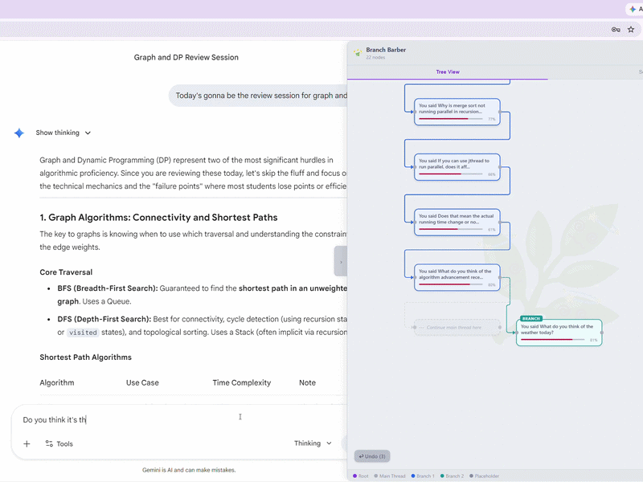

# Branch Barber

<p align="center">
  
</p>

> **Stop shaving the yak. Start climbing the tree.**

**Branch Barber** is a Chrome Extension that transforms linear AI chat logs into a live, interactive **Conversation Tree**. It watches your chat in real time via `MutationObserver`, detects when the conversation drifts to a new topic using a two-layer drift pipeline (synchronous TF-IDF + async on-device semantic embeddings), and renders each branch as a node in a React Flow graph — all without a backend.

Supported platforms: **ChatGPT** · **Google Gemini** · **Claude**. Full light/dark mode (Catppuccin Latte / Mocha).

<p align="center">
  
</p>

<p align="center"><em>Nodes appear in real time as you chat. This conversation stays on-topic so there's no auto-branch — you can still manually branch any node or lower the Drift Threshold in Settings.</em></p>

▶️ [Watch the full demo on YouTube](https://youtu.be/-KdrZlcRvi4)

---

## Install

**Branch Barber is live on the Chrome Web Store — try it for free!**

[](https://chromewebstore.google.com/detail/branch-barber/pancajifpbhmoajlpbnmoigjbdeghifl)

[**→ Get Branch Barber on the Chrome Web Store**](https://chromewebstore.google.com/detail/branch-barber/pancajifpbhmoajlpbnmoigjbdeghifl)

---

## The Problem

AI chat interfaces are linear. Real thinking is not. A session that starts with "build a machine learning model" spirals fast:

```
Root:    Build an ML model
  └─ Branch:  Fix Python environment path
       └─ Branch:  Debug shell permissions
            └─ Now: Researching Linux kernel flags
```

By the tenth side question you've forgotten why you opened the chat. Branch Barber maps this drift, labels each diversion, and lets you jump back to any node without losing work.

---

## Technical Highlights

These are the decisions that made this project non-trivial to build.

### On-Device ML in Chrome Manifest V3

Running `all-MiniLM-L6-v2` inside a Chrome extension required solving an MV3-specific constraint: **service workers cannot execute WebAssembly** due to a strict Content Security Policy and their lack of persistent memory. The fix is an **offscreen document** — a hidden extension page (`offscreen/index.ts`) that loads the Transformers.js WASM pipeline once, keeps it warm across requests, and responds to `EMBED` messages from the service worker. The service worker acts purely as a router; all ML inference happens in the offscreen document. This is the only architecture that keeps a live WASM context in MV3.

### Two-Layer Drift Detection

Drift detection runs in two layers with different latency/accuracy profiles:

| Layer | Method | When | Latency |
|---|---|---|---|
| 1 | TF-IDF cosine similarity | Synchronous, during node creation | ~0 ms |
| 2 | 384-dim embedding cosine similarity | Async, in offscreen WASM document | 200–800 ms |

Layer 1 gives an immediate branch/no-branch decision so the node appears in the tree instantly. Layer 2 refines future comparisons: once an embedding is stored in IndexedDB, subsequent nodes compare against it instead of raw text. The two layers share the same `driftThreshold` and the result is transparent to the user.

### Angular DOM Guard

Gemini is built with Angular web components. Angular re-renders its internal DOM on every streaming update, wiping any child elements extensions inject. Branch Barber works around this by injecting `"✂ Branch Here"` buttons as **siblings** of `<model-response>` — not children — so Angular's re-renders cannot reach them. Each injection stamps a `data-branchbarber-injected` marker on the AI element. On every scan cycle, if the marker is present but the button is gone (Angular replaced the element entirely), the button is re-injected with the correct visual state read from the Zustand store.

### Non-Blocking Node Pipeline

Node creation never waits for ML. The scan loop is synchronous up to the `await upsertNode()` call, then fires the embedding request and optional Gemini summarization as independent promise chains — both with `.catch(() => {})` so an ML timeout never breaks the pipeline. Nodes appear in the tree immediately with a fallback label (first 60 chars of prompt); labels update in place when the async work completes.

### Shadow DOM Isolation

The entire sidebar React tree mounts inside a Shadow DOM host injected into the page. Host-page CSS — including Gemini's and ChatGPT's heavily scoped stylesheets — cannot bleed in. No `!important` overrides needed.

### Position-First Layout

Node positions are computed once at creation time using a parent-relative binary-tree rule (`x = parentX` for a straight continuation, `x = parentX + 240` for a branch) and stored as absolute `(x, y)` coordinates in IndexedDB. No layout algorithm runs at render time. `ReactFlow` receives pre-computed positions directly; Dagre auto-layout is opt-in and leaves stored positions untouched.

### Collapsible Runs

Long conversations often produce chains of `normal` (straight-continuation) nodes that bury the interesting branch nodes below the viewport. Branch Barber identifies maximal chains of ≥ 5 consecutive normal nodes and replaces them with a single **CollapsedNode** showing "▶ N turns". Canvas positions for all nodes after a collapsed run are shifted up by `(run.length − 1) × 130 px` so the visual graph actually compresses — edges shorten, branch structure becomes visible.

---

## Architecture

```
src/
├── background/
│   └── index.ts             # MV3 service worker — routes EMBED messages to offscreen doc,
│                            # manages keepalive alarm, ensures offscreen document stays alive
├── offscreen/
│   └── index.ts             # Offscreen document — loads Transformers.js WASM pipeline,
│                            # pre-warms all-MiniLM-L6-v2 on startup, handles EMBED requests
├── content/
│   ├── index.ts             # Entry point — mounts sidebar, wires bb-reset / bb-rescale events
│   ├── observer.ts          # Core pipeline: MutationObserver → drift detection →
│   │                        # node creation → DB write → store update → button injection
│   ├── selectors.ts         # Platform-specific DOM selectors (ChatGPT, Gemini, Claude)
│   ├── navigator.ts         # Message handler: SHOW_SIDEBAR, RESET_TREE, scroll-to, reset-to
│   └── sidebar-injector.ts  # Injects Shadow DOM host, mounts React sidebar inside it
├── popup/
│   ├── index.tsx            # Popup entry point
│   └── PopupApp.tsx         # "Open Tree" / "New Tree" popup UI
├── store/
│   └── index.ts             # Zustand store — nodes, layout, collapse state, undo stack,
│                            # settings, darkMode; all actions that mutate tree shape
├── db/
│   └── index.ts             # Dexie v1 schema: nodes, conversations, settings tables;
│                            # upsertNode, getConversationNodes, saveSettings, getOrCreateSettings
├── utils/
│   ├── index.ts             # generateId, cosineSimilarity, lexicalDrift (TF-IDF), debounce
│   ├── gemini.ts            # summarizeWithGemini, inferGhostTopic — serial queue +
│   │                        # exponential backoff retry (5 s → 10 s) on 429
│   └── claude.ts            # summarizeWithClaude, inferGhostTopicClaude — routed through
│                            # background service worker to bypass CORS on api.anthropic.com
└── components/
    ├── theme.ts             # Catppuccin Latte (C) + Mocha (CM) palettes; tc(dark) switcher;
    │                        # branchColor(posX, dark) for column-based node coloring
    ├── Sidebar.tsx          # Sidebar shell — Shadow DOM, resize handle, tabs, legend
    ├── ConversationTree.tsx # React Flow canvas — node/edge building, collapse compression,
    │                        # structure hash, magnetic snap, undo, Dagre auto-layout, export
    ├── TreeNode.tsx         # Custom node renderer — drift bar, status badge, column colors
    ├── CollapsedNode.tsx    # Collapsed-run node — stacked card visual, click to expand
    ├── NodeDetail.tsx       # Selected-node inspector — prompt/response preview, branch/
    │                        # unbranch/detach/delete/ghost-delete, full undo integration
    ├── SettingsPanel.tsx    # API key, summary mode, drift threshold, auto-scale toggle
    └── ErrorBoundary.tsx    # React render error boundary for tree and settings panels
```

### Data Flow

```
DOM mutation detected (MutationObserver, debounced 800 ms)
  │
  ├─ Re-query DOM each iteration (guard against Angular replacing elements mid-scan)
  ├─ Extract prompt + response text (pierces Shadow DOM where necessary)
  │
  ├─ Layer 1 drift: TF-IDF cosine similarity vs. parent node text (synchronous)
  │
  ├─ Determine layout position (parent-relative binary-tree):
  │   ├─ No drift → left child  (x = parentX,      y = parentY + 130)
  │   └─ Drift    → right child (x = parentX + 240, y = parentY + 130)
  │                  + ghost left-child placeholder created simultaneously
  │
  ├─ Write node to IndexedDB (upsertNode) — immediate, synchronous with scan
  ├─ Update Zustand store (addNode → buildChildren → React re-render)
  │
  ├─ Fire embedding request → background service worker → offscreen WASM pipeline
  │   (async; updates DB + enables Layer 2 comparisons when it arrives; never blocks)
  │
  ├─ If live turn + API key configured: call Gemini / Claude for 8-word label (async)
  │   Ghost label: inferGhostTopic (priority queue, fires first)
  │   Node label:  summarizeWithGemini/Claude (after ghost; serial queue, 1 s gap)
  │
  └─ Inject "✂ Branch Here" button as sibling of AI element (Angular-safe)
```

### Key Design Decisions

**MV3 Offscreen Document for WASM** — Chrome MV3 service workers are stateless, short-lived, and cannot run WebAssembly. An offscreen document is a persistent hidden page with `wasm-unsafe-eval` CSP that hosts the Transformers.js pipeline. It restarts automatically via the background keepalive alarm and re-warms the model from cache on restart.

**Live-turn-only API calls** — when a conversation is first opened, all historical turns are batch-processed with no Gemini/Claude calls (zero risk of 429). API summarization fires only for turns typed after the tree opened — at most one or two calls per user message.

**Serial queue with exponential backoff** — all Gemini calls go through a single in-memory serial queue with a 1-second minimum gap between calls. On a 429, the queue waits 5 s → 10 s (up to 3 attempts) before giving up silently. This keeps usage within Gemini's 15 RPM free tier even during rapid conversations.

**Structure hash** — `ConversationTree` computes a hash of `id:parentId:status:posX` for every node and skips rebuilding the full ReactFlow node/edge arrays when only `selectedId` changes. Selection updates mutate the existing array in-place, avoiding expensive re-renders on every click.

**Collapse position compression** — when a run is collapsed, a `computeCollapsePositionOverrides` pass walks each visible node's ancestor chain and subtracts the pixels saved by every collapsed run above it. Stacked collapsed runs compound correctly. Positions stored in IndexedDB are never touched; the overrides are display-only.

**Concurrency lock** — `isScanning` prevents re-entrant `scanAndProcessTurns` invocations. The lock is cleared by `resetLayout()` so a new conversation never inherits a stale lock from the previous one.

---

## Drift Detection

### Layer 1 — Lexical TF-IDF (synchronous)

The combined prompt + response text (up to 512 characters) is tokenized, stopwords are filtered, and cosine similarity is computed over term-frequency vectors against the parent node's text. Drift score = `1 − similarity`. Runs in-process with zero latency — no network, no async.

### Layer 2 — Semantic Embeddings (async, improves over time)

Each node is embedded using **`all-MiniLM-L6-v2`** (Transformers.js, WASM backend, offscreen document). The 384-dimensional vector is stored in IndexedDB. Once an embedding is available, future drift comparisons use full semantic cosine similarity instead of lexical overlap — catching paraphrasing and domain shifts that TF-IDF misses.

### Threshold

Both layers share a single `driftThreshold` (default **80%**). If `driftScore > threshold`, the node is automatically branched. The threshold is configurable in Settings and can be retroactively applied to the entire existing tree via the Auto-scale toggle, which rebuilds ghost nodes and branch positions without touching non-ghost nodes' content.

---

## Node Types

| Badge | Status | Meaning |
|---|---|---|
| **Root** | `root` | First turn of the conversation. Fixed at canvas origin (0, 0). |
| *(none)* | `normal` | Straight continuation of the current branch. |
| **Branch** | `side-quest` | Auto-detected or manually confirmed branch. Gets column color. |
| *(italic)* | `ghost` | Placeholder inserted at the left-child slot when a branch forks right. Dashed edge. |
| **Isolated** | `normal` (detached) | Node severed from the tree via NodeDetail. Floats freely. |

Branch colors are assigned by column (`Math.round(posX / 240) % 8`), cycling through Catppuccin colors: mauve → blue → teal → green → peach → pink → sapphire → maroon. All nodes in the same column share a color regardless of depth.

---

## Getting Started

### Build

```bash
npm install
npm run build      # output → dist/
npm run dev        # Webpack watch mode for development
```

### Load in Chrome

1. Open `chrome://extensions/`
2. Enable **Developer mode** (top-right toggle)
3. Click **Load unpacked** → select the `dist/` folder
4. Navigate to `chatgpt.com`, `gemini.google.com`, or `claude.ai`

### Reload After Changes

Go to `chrome://extensions/` and click the ↺ icon on the Branch Barber card, then hard-reload the tab (`Ctrl+Shift+R`).

---

## Tech Stack

| Layer | Technology |
|---|---|
| Language | TypeScript (strict) |
| UI framework | React 18 |
| State management | Zustand |
| Tree visualization | React Flow · Dagre (opt-in auto-layout) |
| Local persistence | Dexie.js (IndexedDB) |
| On-device ML | Transformers.js · `all-MiniLM-L6-v2` · WebAssembly |
| Optional summarization | Gemini 2.0 Flash · Claude Haiku (via background CORS proxy) |
| Build | Webpack 5 (multi-entry MV3 config) |
| Extension API | Chrome Manifest V3 |
| Color system | Catppuccin Latte / Mocha |

---

## Roadmap

- [x] MutationObserver pipeline for ChatGPT, Gemini, and Claude
- [x] Shadow DOM sidebar with React Flow tree
- [x] Lexical TF-IDF drift detection (synchronous, no dependencies)
- [x] Semantic drift via Transformers.js + WebAssembly in offscreen document (async)
- [x] Binary-tree parent-relative layout with ghost placeholders
- [x] Manual and auto branch/unbranch with full subtree shifting
- [x] Magnetic snap on node drag with subtree reparenting
- [x] Resizable sidebar (up to 1200 px)
- [x] Undo (20-step history with IndexedDB sync)
- [x] Node detail panel — resizable, full prompt + response preview, all edit actions
- [x] Auto-scale Drift Threshold (retroactive full-tree re-layout)
- [x] `"✂ Branch Here"` inline button on every AI response (Angular re-render safe)
- [x] Live-turn-only API calls (prevents 429 on batch load)
- [x] Serial queue with exponential backoff for Gemini and Claude
- [x] AI node labels — 8-word summaries via Gemini 2.0 Flash or Claude Haiku
- [x] Dark mode (Catppuccin Latte ↔ Mocha) — persisted, synced between popup and sidebar
- [x] Dagre auto-layout — opt-in TB reflow; stored positions untouched
- [x] Export as PNG or JSON
- [x] Collapsible runs — chains of ≥ 5 normal nodes compress into a single stacked-card node with canvas position compression
- [x] **Chrome Web Store release** — [live now](https://chromewebstore.google.com/detail/branch-barber/pancajifpbhmoajlpbnmoigjbdeghifl)
- *(Cross-device sync intentionally omitted — Branch Barber is local-first by design)*

---

## Privacy

- All conversation data (prompts, responses, embeddings, positions) is stored **locally** in IndexedDB via Dexie.js. Nothing leaves your browser without an explicit API key.
- The embedding model runs entirely **on-device** via WebAssembly. No text is sent to any server for embedding.
- The only optional network calls are to the **Gemini API** or **Anthropic API** for label generation — only when you configure an API key and select that mode. Requests include up to ~500 characters of your prompt and response.
- No telemetry, no analytics, no external logging of any kind.

---

## Author

Built by **Yiwen Ding**

- Email: [dingywn@seas.upenn.edu](mailto:dingywn@seas.upenn.edu)
- GitHub: [@dingonewen](https://github.com/dingonewen)

<p align="center">
  
</p>

---

License: MIT
